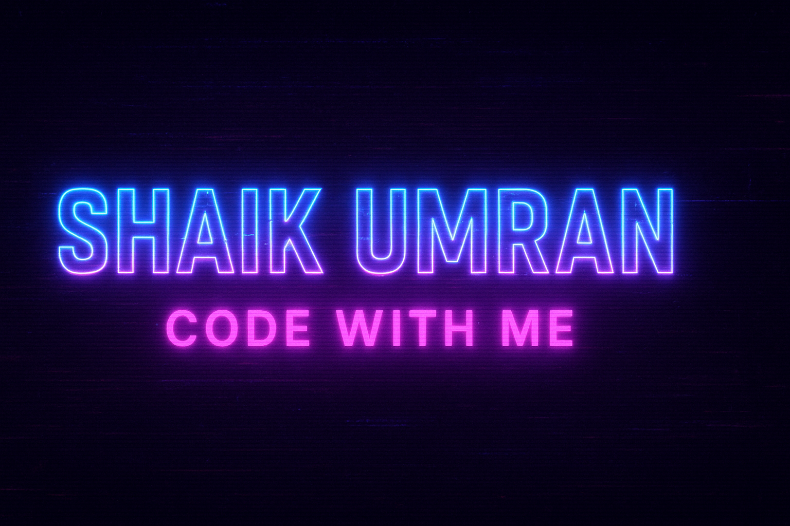

  

  

---

# 👋 Hey, I'm Umran  

## 🌱 About Me  
- 🔭 I’m currently working on **Tensorflows**  
- 🌱 Learning **Machine Learning**  
- 💡 Ask me about **Python, Python Libraries, HTML, CSS, JavaScript, OS**  
- 📫 Reach me at: **shaikumran487@gmail.com**  
- ⚡ Fun fact: I turn ☕ into code & chaos into creativity  

---

## 🌐 Connect with Me  
   
  
  

---

## ⚒️ Languages & Tools  
  
  
  
  
  
  
  
  
  

---

## 📊 GitHub Stats  
  
  

---

⭐️ *From [Shaik](https://github.com/umran666)*  
